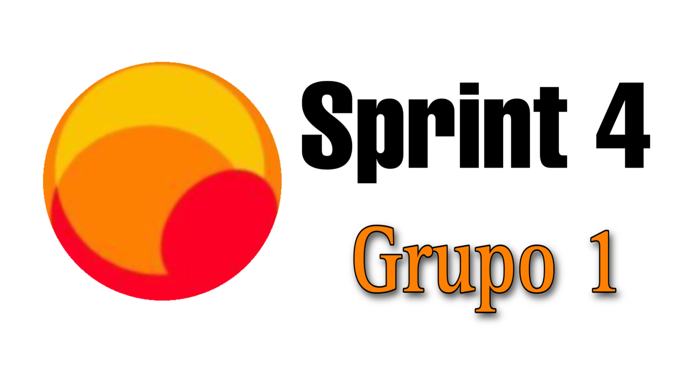
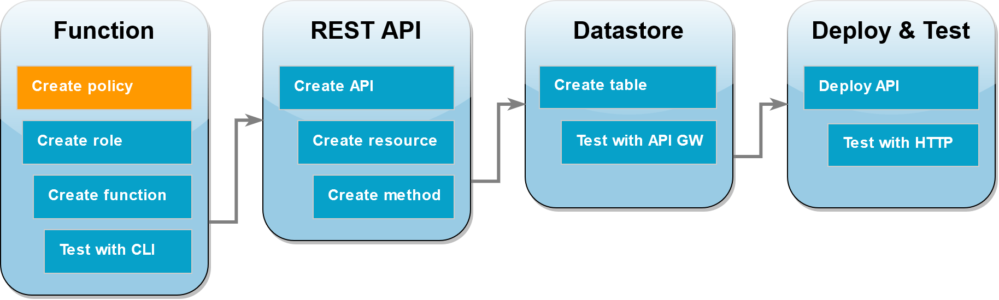
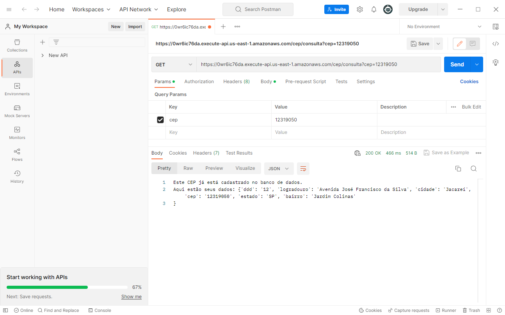
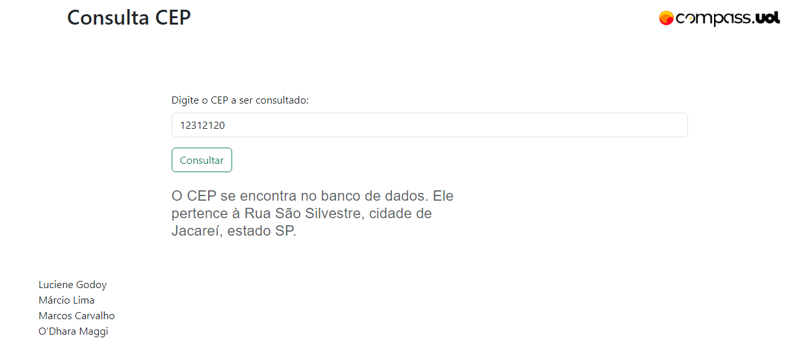

# Avaliação [Sprint 4](https://github.com/Compass-pb-aws-2023-Univesp/sprint-4-pb-aws-univesp) - Programa de Bolsas Compass UOL / AWS e Univesp 



## Informações
<p align ="justify">Este projeto foi realizador por um grupo com quatro componentes, que desenvolveram o trabalho completo, mas tiveram responsabilidades específicas para elaboração deste documento.</p>

### Organização da equipe

|*Componentes* | *Responsabilidades específicas* |
|---|  ---|
|Luciene|API Gateway e documentação|
|Márcio|Interface gráfica|
|Marcos|Lambda e API |
|O'Dhara|Interface gráfica|


## Descrição do projeto proposto
<p align ="justify"> A proposta do projeto foi desenvolver uma função em AWS Lambda para criação de uma API própria que realiza uma consulta numa API pública. O resultado esperado era que nossa API consultasse uma tabela do DynamoDB para verificar se os dados já estavam armazenados ali. Caso positivo, deveria retornar tais dados. Caso oposto, nossa API deveria fazer uma requisição na API pública, armazenar os dados no banco e retornar estes dados para esta e próximas consultas.</p>


[](https://aws.amazon.com/) [](https://www.python.org/)

 

## Desenvolvimento do Projeto
O Projeto foi desenvolvido na plataforma da [AWS](https://aws.amazon.com/) com a linguagem [Python](https://www.python.org/). Criamos um script que consulta uma tabela do banco de dados DynamoDB e uma APi pública, a [viacep]('https://viacep.com.br/ws/{cep}/json/). O resultado esperado é o retorno de informações relacionadas ao CEP passado pelo usuário. Para isso, usamos uma função Lambda para conexão com a API Gateway.
  
- ### Arquitetura do projeto


- ## Função Lambda
    * ### Criar politica
      * Entre na página [IAM políticas](https://aws.amazon.com/pt/iam/?nc2=type_a) escolha `Criar política` e na aba `JSON` escreva o código JSON. Esta política libera acessoa a todas as operações com o DynamoDB.

      ```json
        {
        "Version": "2012-10-17",
        "Statement": [
            {
                "Sid": "VisualEditor0",
                "Effect": "Allow",
                "Action": "dynamodb:*",
                "Resource": "*"
            }
        ]
        }
      ```
      * Escolha `Próximo: Tags` e `Próximo: Revisar`; 
      * Escolha o nome da política e coloque sua lambda;
      * Escolha `Criar política`.

    * ### Criar perfil
        * Entre na página IAM Funções;
        * Selecione `Criar Funções` selecione `Serviço da AWS ` , `Lambda` e na caixa de pesquisa insira o nome da sua função e escolha `próximo`;
        * Em detalhes do perfil para nome do perfil coloque o nome do seu perfil e escolha `Criar perfil`.

    * ### Criar função em Python
        * Crie a sua função em Pyhon na sua IDE e compacte a pasta (.zip).        
        * Encontre sua função Lambda AWS e faça upload do arquivo que contém a função.
- ### Testar funcionamento
    * Vá na aba `Testar` da sua função Python e crie um código JSON para testar o funcionamento da sua função.


 - #### REST API usando a API Gateway
    * ### Criar API
        * Entre na página da API Gateway e clique em `Criar API`;
        * Entre as APIs escolha `API REST` e clique em construir; 
        * Em configurações, escreva o nome da API e escolha o Endpoint Type e clique em `Criar API` 

    * ### Criar recurso
        * Abra a sua API e clique e na aba recursos, selecione no diretório `/consultacep` e no botão `Ações`  escolha o método GET e salve (✔ ).
     
    * ### Método de criação
        * Clique no método GET e em tipo de integração escolha ` Lambda Function`, região `******`, o nome da sua função ` Lambada****` e clique em `salvar`;
        * No botão `Ações ` escolha `Deploy API`.

- #### Banco de Dados DynamoDB
    * ### Criar tabela 
        * Abra a página [DynamoDB](https://aws.amazon.com/pt/dynamodb/) em tabelas e escolha `Criar tabela` em detalhes da tabela:
            * Em nome da tabela escolha sua tabela;
            * Para a  **Chave de partição**, insira  `id` e `String`.
        * Escolha a configurações da sua tabela ou mantenha os padrões, e clique em `Criar tabela`.

    * ### Testar com API Gateway
        * Localize a sua API Gateway e na coluna Recursos, escolha o método `GET` e no painel de execução, na caixa cliente e escolha `Testar`;
        * No campo de texto digite o CEP com 8 dígitos, no formato `cep=12345678`
        e clique em `testar`, veja o resultado e depois vá até sua tabela do DynomoDB e veja se está funcionando;

               
- ## Deploy e Testes da API
    * ### Deploy da API
        * Vá até a página da [API Gateway](https://aws.amazon.com/pt/api-gateway/);
        * Entre na sua API e clique em `Ações` e em `Deploy API`;
        * Para Deployment stage,  escolha  `Novo estágio` e clique em `Deploy`.

    * ### Testar HTTP
        * No campo de endereço do browser cole o seguinte link e substitua o campo `{cep}` com o CEP desejado para realizar uma consulta. O resultado deverá ser retornado direto na tela do navegador.

        `https://0wr6ic76da.execute-api.us-east-1.amazonaws.com/cep/consultacep?cep={cep}`

        * Este teste também pode ser realizado utilizando o software [Postman](https://www.postman.com/) da seguinte forma: adicione a `URL` como na imagem abaixo, utilizando o método `GET`.
        

    * ### Testar na webpage
        * Baixe este respositório e inicie a aplicação com `node app.js`.

        

- ## Dificuldades apresentadas
    * Utilização da plataforma AWS (pouco intuitiva);
    * Relacionamento entre API Gateway, Função Lambda e DynamoDB.

---
- ## Conclusão
    * No final nossa API ficou assim 👉 [Nossa api](https://0wr6ic76da.execute-api.us-east-1.amazonaws.com/cep/consultacep?cep=99010051).
