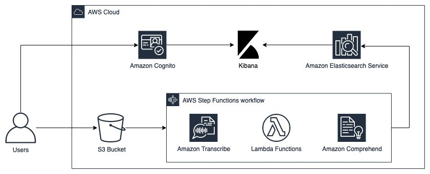
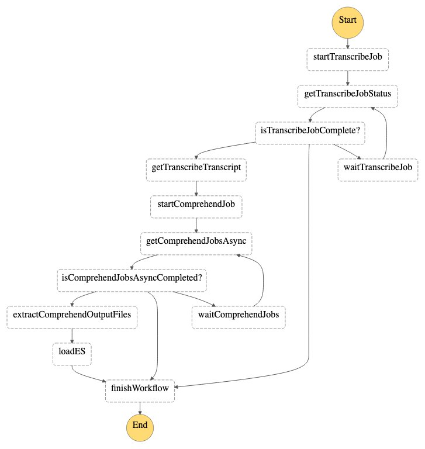
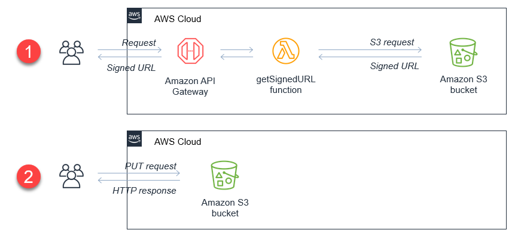
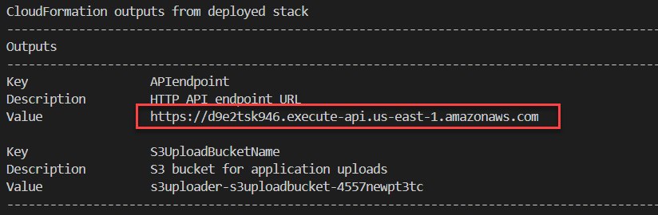
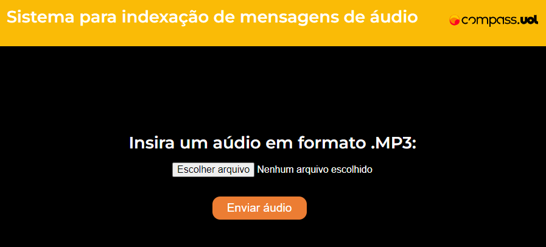
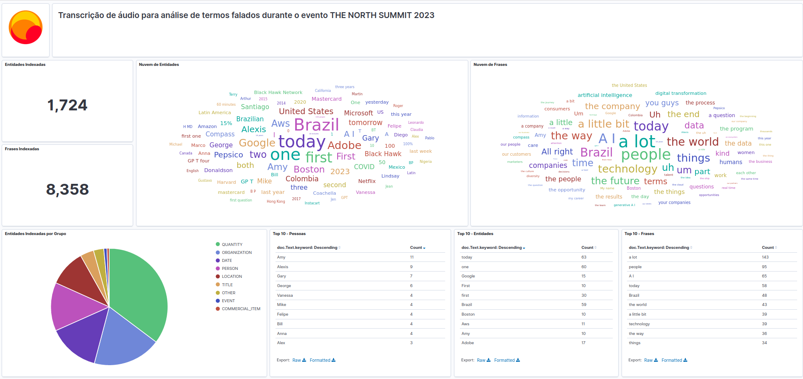

# Avaliação Sprint 6 - Programa de Bolsas Compass UOL / AWS e Univesp

## Introdução

Em decorrência da pandemia de COVID-19, a geração de conteúdos em áudio e vídeo aumentou significativamente de 2021 para cá. Além das dificuldades conhecidas em relação ao armazenamento de quantidade massivas de dados, seu gerenciamento também é um desafio. O processamento de textos, áudio e videos envolve etapas como transcrição, indexação, identificação e pesquisa de termos específicos, gerando uma importante padronização na análise do material.

Num ambiente AWS Cloud, diferentes serviços podem ser utilizados para facilitar a implementação destas etapas, como o AWS Transcribe, que processa áudio e realiza sua transcrição para texto. Outro serviço é o AWS Comprehend, respnsável por realizar a indexação do texto, indentificando termos e expressões significativas, facilitando assim a realização de pesquisas e análise estastística em estruturas visuais (gráficos, tabelas, nuvens de palavras, etc.) 

## Objetivo

A proposta deste repositório é a criação de uma solução para ingestão e indexação automática de arquivos de áudio por meio de um *workflow* de orquestração baseado em funções AWS Lambda.

A solução segue a ideia de que, a partir do momento em que se faz o *upload* de um arquivo `.mp3` para um *BucketS3*, o *workflow* se inicia automaticamente e realiza a transcrição e indexação do material, de acordo  com o idioma especificado.

Como resultado, esperamos criar índices e gráficos que suportem soluções de pesquisa para facilitar a análise dos dados.

<div align="center">
  
  <sub><i><p>Arquitetura proposta para a solução. </p>
  <p style="margin-top:-10px">Fonte: https://aws.amazon.com/pt/blogs/aws-brasil/indexando-audios-com-amazon-transcribe-amazon-comprehend-e-elasticsearch/</p></i></sub>
</div>

## Serviços das AWS utilizados na implementação solução

Os principais serviços da AWS utilizados para o desenvolvimento deste projeto são:
  * **Amazon S3**: solução de armazenamento de dados onde armazenaremos os áudios para serem transcritos; também é o S3 que recebe o resultado do processamento (textos transcritos e arquivos de indexação);
  * **Amazon Transcribe**: serviço que realiza a transcrição de áudio para texto;
  * **Amazon Comprehend**: analisa um texto aplicando técnicas de Processamento de Linguagem Natural (PLN) para extrair palavras-chave, dando suporte à remoção de palavras que não agregam valor ao texto (*stop-words*), indexação de nomes próprios (locais, pessoas, organizações), sendo também capaz de indexar expressões (datas, locuções) e suporte à análise de sentimentos;
  * **AWS Lambda**: ambiente para execução de códigos sem necessidade de privisionamento de servidor (suporte à arquitetura *serverless*);
  * **AWS Step Functions**: solução para gerenciar o *workflow* de transcrição e análise dos arquivos de áudio realizados por diferentes Lambda Functions;
  * **Amazon Elastic Search Service**: *cluster* gerenciado do Elasticsearch que armazena as informações extraídas e permite a criação de índices e visualizações dos dados através do Kibana;
  * **Amazon Cognito**: solução para autenticação de usuários que garante acesso ao `Kibana` no cluster do Elasticsearch.
  

<div align="center">
  
  <sub><i><p>Representação visual do *workflow* descrito acima</p></i>
  <p style="margin-top:-10px">Fonte: https://aws.amazon.com/pt/blogs/aws-brasil/indexando-audios-com-amazon-transcribe-amazon-comprehend-e-elasticsearch/</p</sub>
</div>

Para mais detalhes a respeito das funções deste *workflow*, [acesse](https://aws.amazon.com/pt/free/?trk=c9dcfe7b-33fc-4345-b0c3-77b810bbd58c&sc_channel=ps&ef_id=EAIaIQobChMIw_j1nOLW_gIVNQZ9Ch3HPQF6EAAYASAAEgJE1vD_BwE:G:s&s_kwcid=AL!4422!3!454435137261!e!!g!!aws%20services!10758390156!106168762716).

# Implementação do Projeto

Foi preparado um projeto SAM (AWS Serverless Application Model) como forma de facilitar a replicação. Todos os componentes destacados na arquitetura e etapas do *workflow* podem ser implementados em uma conta AWS, utilizando recursos do [repositório oficial da AWS](https://github.com/aws-samples/serverless-audio-indexing).

## Pré Requisitos

Para replicação deste projeto, certifique-se de ter instalado e/ou configurado os seguintes recursos:

- [ ] Configure as Credenciais AWS no seu ambiente. Veja: [Configurando credenciais](https://docs.aws.amazon.com/cli/latest/userguide/cli-configure-files.html)
- [ ] Baixe e instale a AWS CLI. Veja: [Instalando AWS CLI](https://docs.aws.amazon.com/cli/latest/userguide/cli-chap-install.html)
- [ ] Baixe e instale o AWS Serverless Application Model CLI. Veja: [Instalando o AWS SAM CLI](https://docs.aws.amazon.com/serverless-application-model/latest/developerguide/serverless-sam-cli-install.html)
- [ ] Baixe e instale o Docker no seu ambiente local. Veja: [Instalando o Docker](https://www.docker.com/products/docker-desktop)
- [ ] Baixe e instale o NodeJS. Veja: [Instalando o NodeJS](https://nodejs.org/pt-br/download/package-man)

## 1º Deploy

Clone [este repositório](https://github.com/aws-samples/serverless-audio-indexing) e navegue até o diretório raiz. 

No terminal insira o seguinte comando:

```
  sam build --use-container && sam deploy --guided
```
A execução cria uma *stack* (pilha) do AWS Cloud Formation com todos os componentes necessários do *workflow*. 

Acompanhe o *deploy* inserindo os parâmetros necessários, como nome, zona de execução (ex: us-east-1) e idioma. Escolha `en-US` para inglês dos Estados Unidos ou `pt-BR` para português do Brasil.

Com esta primeira fase do projeto concluída, já é possível iniciar o *workflow* fazendo o *upload* de arquivos `.mp3` diretamente pelo Console da AWS.

Contudo, como forma de prover ao usuário uma maneira mais prática de realizar o *upload* dos áudios, criaremos em seguida uma interface WEB para o envio dos áudios ao S3.

Para isso, desenvolveremos a seguinte estrutura para realizar um *upload* direto da web para um *BucketS3*.
<div align="center">
  
  <sub>
    <i>
      <p>Arquitetura de envio de arquivos para um *BucketS3*</p>
      <p style="margin-top:-10px">Fonte: https://aws.amazon.com/pt/blogs/compute/uploading-to-amazon-s3-directly-from-a-web-or-mobile-application/</p>
    </i>
  </sub>
</div>

Para o *front-end* da aplicação será necessário solicitar um URL "assinado", processo dividido em duas etapas:

- Chamamos o Endpoint de uma API Gateway que invoca uma função Lambda nomeada getSignedURL. Essa função retorna um URL assinado pelo *BucketS3* que aprova o *upload* do arquivo.
- com o URL assinado, realizamos o *upload* diretamente do *front-end* para o *BucketS3*.

## 2º Deploy

Clone [este segundo repositório](https://github.com/aws-samples/amazon-s3-presigned-urls-aws-sam). Atualize o arquivo `template.yaml` nas linhas 35 e 38 para referenciar ao seu *BucketS3* da entrada de arquivos .mp3 que inicializarão o *workflow* implementado. Por padrão, será a opção que contenha **RawS3Bucket** no nome.

Adicionalmente, será preciso alterar o arquivo `app.js` contido na pasta `getSignedURL` para que seja solicitado um URL para envio de áudio. Na linha 32, modifique a extensão de `.jpg` para `.mp3`. Agora na linha 39, defina o ContentType para `audio/mpeg`.

Após estes passos, o projeto está pronto para ser implementado. Abra o terminal no diretório clonado e execute o comando:
```
sam deploy --guided
```
Durante o deploy, preencha os parâmetros que achar necessário ou dê enter para definir a opção default.

Este deploy leva vários minutos e, ao fim da execução, salve o valor de output pois ele será necessário na próxima etapa.
<div align="center">
  
  <sub><i><p>Valores apresentados pós deploy</p></i></sub>
</div>

## Execução


Esta interface _web_ proporcionará ao usuário o envio de arquivos de forma prática, sem precisar estar autenticado no console da AWS. Para isto funcione, é necessário alterar o link do _API_ENDPOINT_ no script da interface. Na linha 62, altere o link do _API_ENDPOINT_ gerado no segundo deploy para que o envio seja feito para o seu BucketS3.

Envie este arquivo `index.html` para um BucketS3 e torne-o público para que fique disponível online. Configure [Cross-Origin Resource Sharing (CORS)](https://developer.mozilla.org/en-US/docs/Web/HTTP/CORS) no BucketS3 que contenha `RawS3` no nome para que o envio de arquivos externos seja possível.

Com a toda a arquitetura implementada na conta, podemos dar início ao *workflow* de transcrição. Para isto, o link do seu BucketS3 que aponta para o `index.html`.

<div align="center">
  
  <sub>
    <i>
      <p>Frontend da aplicação de envio de áudios</p>
    </i>
  </sub>
</div>

Assim, o usuário poderá acessar a interface, selecionar um arquivo `.mp3` de seu dispositivo e clica em enviar. 

Com o upload bem-sucedido, quando o arquivo chega ao *BucketS3*, é disparado um gatilho que dá início ao *workflow* de transcrição para posterior compreensão.

##  Estimativa de custos com a infraestrutura

Os recursos gerados pelos dois deploys descritos acima geram os seguintes custos mensais:

### Deploy 1
| Recurso AWS  | Custo Mês ($) |
| :--- | ---: |
| Elastic Search (r5.large.search)  | 137,00  |
| *BucketS3*  | 0,23  |
| *BucketS3*  | 0,23  |
| Cognito  | 0,50  |
| IAM  | free tier  |
| Lambda  | free tier  |
| Step Functions  | free tier  |

### Deploy 2
| Recurso AWS  | Custo Mês ($) |
| :--- | ---: |
| Elastic Search (r5.large.search) | 137,00  |
| *BucketS3*  | 0,23  |
| Cognito  | 0,50  |
| IAM  | free tier  |
| Lambda  | free tier  |
| API Endpoint  | free tier  |

#### Total : $ 275,69

Já se os recursos dos projetos fossem alterados, substituindo alguns elementos por outros com capacidade reduzida de processamento, os seguintes custos seriam alcançados:

### Deploy 1
| Recurso AWS  | Custo Mês ($) |
| :--- | ---: |
| Elastic Search (t2.micro.search) | 14,36  |
| *BucketS3*  | 0,23  |
| *BucketS3*  | 0,23  |
| Cognito  | 0,50  |
| IAM  | free tier  |
| Lambda  | free tier  |
| Step Functions  | free tier  |

### Deploy 2
| Recurso AWS  | Custo Mês ($) |
| :--- | ---: |
| Elastic Search  (t2.micro.search) | 14,36  |
| *BucketS3*  | 0,23  |
| Cognito  | 0,50  |
| IAM  | free tier  |
| Lambda  | free tier  |
| API Endpoint  | free tier  |

#### Total : $ 30,41

Percebe-se que há uma redução de gastos de aproximadamente 90% com a alteração. Essa mudança pode ser um próximo passo para o projeto, a depender dos requerimentos de implementação.

*Observação: a única diferença nos cenários calculados estão nas instâncias do Elastic Search. Para os demais recursos, foram considerados cenários de uso não intensivos (poucos acessos e armazenamento pequeno).*

## Testes

O grupo escolheu trabalhar com a transcrição de áudio do evento anual **The North Summit**, realizado pela CompassUOL em 25/04/2023.

<div align="center">
  
  <sub>
    <i>
      <p>THE NORTH SUMMIT 2023 ₢ CompassUOL</p>
    </i>
  </sub>
</div>

A partir do vídeo transmitido ao vivo pelo YouTube, foi extraída a faixa de áudio, o qual foi segmentado em arquivos menores, e enviados em formato `.mp3` para o *BucketS3* que dá início ao *workflow*.

O resultado pode ser conferido na sequência.

## Resultados

A indexação é feita através da criação de índices e elementos gráficos no Kibana, podendo estes serem integrados para compor um *dashboard*.

Um passo a passo, criado pelo grupo, pode ser conferido [neste PDF](./files/Kibana_tutorial.pdf).

<div align="center">
  
  <sub>
    <i>
      <p>Dashboard criado no Kibana após criação dos indexes</p>
    </i>
  </sub>
</div>

É possível observar duas nuvens de palavras: uma contendo as entidades mais presentes e a outra as expressões mais faladas durante o evento. 

Por ser iterativo, o *dashboard* permita a aplicação de filtros, como por exemplo à nome de pessoas mais citados (PERSON). Considerando os resultados obtidos após processamento dos áudios do evento: 

- Amy Webb foi a pessoa mais citada durante o evento, seguida por Alexis Rockenbach;

- O grupo supôs, anteriormente à análise dos áudios, que o termo "<i>AI</i>" estaria em destaque no evento. A suposição pode ser confirmada observando a tabela `Top 10 - Frases`, na qual "<i>AI</i>" aparece em terceiro lugar;

- Também é possível traçar uma correlação interessante: O fato de "<i>people</i>" ter sido o segundo termo mais mencionado e "<i>AI</i>" o terceiro, sugere que as discussões enfatizaram a importância dos aspectos humanos em meio à evolução tecnológica. Pode-se inferir que houve um interesse em equilibrar a discussão sobre os avanços tecnológicos e a valorização das relações e necessidades humanas.

Mais visualizações deste dashboard podem ser conferidas [neste diretório](./files/img/).

## Conclusão

A realização das atividades da *Sprint6* evidenciam possíveis aplicações  utilizando processamento de áudio, sua transformação em texto escrito e posterior análise de elementos constituintes dos discursos, utilizando somente ferramentas da AWS Cloud. 

Os recursos nativos da plataforma do AWS Transcribe e AWS Comprehend permitem a consecução dessas tarefas. Aliado ao recurso nativo do Elastic Search para análise e construção de visualização, o Kibana, também disponível na AWS, torna-se possível que os dados extraídos processados a partir dos áudios, sejam analisados graficamente. Essa possibilidade de análise permite uma variade de tarefas a serem implementadas, como a análise de eventos transmitidos por vídeo, por exemplo.

Possíveis próximos passos para escalar este projeto são: 
  - Unificação dos arquivos .yaml dos dois tutoriais, a qual geraria em um único *build* toda a *stack* do projeto, facilitando assim sua implementação;
  - Troca de recursos de infraestrutura dentro dos mesmos arquivos .yaml por instâncias mais baratas, com o fim de se evitar desperdícios de recursos com testes.

## Dificuldades

Devido ao costume com outras ferramentas de análise e visualização de dados (principalmente PowerBI), o uso do Kibana se mostrou um pouco complicado e inicialmente confuso. As dificuldades foram vencidas com pesquisa e experimentação.

## Referências

* [Descoberta e indexação de episódios de podcast usando o Amazon Transcribe e o Amazon Comprehend](https://aws.amazon.com/blogs/machine-learning/discovering-and-indexing-podcast-episodes-using-amazon-transcribe-and-amazon-comprehend/)

* [Criação de um índice de pesquisa com tecnologia NLP com o Amazon Textract e o Amazon Comprehend](https://aws.amazon.com/blogs/machine-learning/building-an-nlp-powered-search-index-with-amazon-textract-and-amazon-comprehend/)

* [Indexando áudios com Amazon Transcribe, Amazon Comprehend e ElasticSearch](https://aws.amazon.com/pt/blogs/aws-brasil/indexando-audios-com-amazon-transcribe-amazon-comprehend-e-elasticsearch/)

* [Uploading to Amazon S3 directly from a web or mobile application](https://aws.amazon.com/pt/blogs/compute/uploading-to-amazon-s3-directly-from-a-web-or-mobile-application/)

***

<div align="center" style="padding: 20px">
  
  <sub>
    <i>
      <p style="padding: 10px">Desenvolvedores deste projeto</p>
    </i>
  </sub>
</div>
