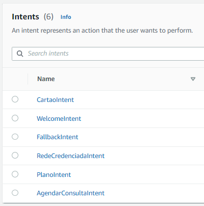
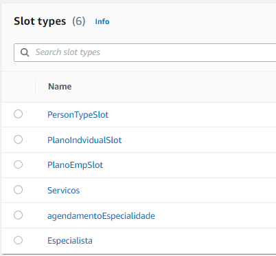

  
  

# 📑 Avaliação da Sprint 7 - Programa de Bolsas Compass UOL / AWS e Univesp

## 📌 Navegação

- [📝 Introdução](#introdução)
- [🤖 Lex V2](#amazon-lex-v2)
- [🎯 Objetivo](#objetivo)
- [💻 Desenvolvimento](#desenvolvimento)
  * [🔧 Ferramentas e tecnologias utilizadas](#feramentas-e-tecnologias-utilizadas)
  * [🚀 Deploy com Slack](#deploy-com-slack)
- [📏 Arquitetura](#arquitetura)
- [🏁 Resultado](#resultado)
- [📋 Organização](#organização)
- [🤷 Dificuldades](#dificuldades)
- [👥 Equipe](#equipe)

***

## 📝Introdução

O uso de chatbots em serviços de plano de saúde pode trazer vários benefícios tanto para as empresas como para os usuários. Com a ajuda dos chatbots, as empresas podem fornecer atendimento ao cliente 24 horas por dia, 7 dias por semana, sem a necessidade de contratar mais funcionários ou pagar por horas extras. Além disso, os chatbots podem oferecer respostas imediatas e precisas às perguntas dos usuários, ajudando a reduzir a frustração e o tempo de espera. Os chatbots também podem ser programados para fornecer informações sobre cobertura de serviços, agendar consultas e até mesmo fornecer lembretes sobre a necessidade de exames ou medicamentos, aumentando assim a eficiência do serviço. Em resumo, o uso de chatbots pode melhorar a experiência do usuário e reduzir os custos operacionais das empresas de planos de saúde.

### 🤖Amazon Lex V2

O chatbot Lex V2 da Amazon é uma plataforma de inteligência artificial que permite aos desenvolvedores criarem bots de conversação altamente personalizáveis. O Lex V2 utiliza técnicas de processamento de linguagem natural para entender e interpretar o que os usuários estão dizendo, permitindo que os bots respondam de forma inteligente e relevante. Além disso, o Lex V2 é altamente escalável, permitindo que os desenvolvedores criem bots que possam lidar com um grande volume de tráfego e interações com os usuários. Com sua interface intuitiva e flexibilidade, o Lex V2 é uma ferramenta poderosa para empresas que desejam fornecer suporte ao cliente, atendimento automático e soluções de autoatendimento eficientes.

***

## 🎯Objetivo

O objetivo do grupo foi desenvolver um chatbot para uma Operadora de Planos de Saúde. As funcionalidades principais do bot giram em torno de:
 * oferecer informações ao usuário sobre os tipos de plano de saúde disponíveis para ele;
 * informações sobre a rede credenciada
 * prover a emissão de uma segunda via do cartão de beneficiário e;
 * permitir o agendamento de consultas com profissionais especializados.

***
## 💻Desenvolvimento

### 🔧Feramentas e tecnologias utilizadas
  Todo o desenvolvimento do projeto foi realizado através do console do Lex V2 na AWS.
  * [Amazon Lex V2](https://docs.aws.amazon.com/lexv2/latest/dg/what-is.html): serviço para criar interfaces conversacionais para aplicativos que usam voz e texto.

Para construção do bot, é importante estar claro qual problema o chatbot irá solucionar e quais informações e finalidades ele precisa ter. A partir disso criamos as _intents_ que nada mais são que intenções que o seu usuário deseja alcançar, como por exemplo encomendar flores, uma pizza ou apenas fazer uma reserva num hotel. Todo bot deve ter ao menos uma _intent_.

Por padrão todo bot recémcriado tem uma _intent_ interna chamada _FallbackIntent_. Essa é uma intent _default_ acionada quando o bot não reconhece qualquer outra intenção passada pelo usuário. Portanto, para dar início a construção do bot, tenha em mente  o problema que ele solucionará e vá criando novas _intents_ conforme achar necessário.

As _intents_ capturam _slots_ que nada mais são que valores passados pelo usuário e armazenados para futuro uso. Por exemplo, a _intent_ de boas vindas pode solicitar o nome do usuário e seu telefone, esses valores são armazenados cada um em seu respectivo _slot_. Existem _slots_ construídos pela própria Amazon como por exemplo, _slots_ que recebem nome de cidades, estados, número de telefone e nome/sobrenome. Já, se for necessário para o seu projeto, você também pode criar _custom slots_ que poderão armazenar valores customizados, como médico especialista e tipo de conta bancária (corrente ou poupança). O slot é o responsável por lançar uma questão ao usuário, como por exemplo, perguntando seu nome, telefone e o que deseja fazer naquele chat.

As _intents_ pelo usuário possuem um fluxo de execução que precisa ser configurado desde o _prompt_ ao usuário (_Initial Response_) à sua conclusão (_Closing Response_). As respostas fornecidas pelo usuário são capazes de o encaminhar para diferentes rotas dentro do chat.

  

    
    
      
Intents criadas para o projeto

    
  

  

    
    
      
Custom slots criados para o projeto

    
  

***
## 🚀Deploy com Slack

A integração de um chatbot de Plano de Saúde com uma plataforma de mensageria pode trazer diversos benefícios, entre eles:
- Melhora na comunicação e colaboração: o Slack permite aos usuários uma forma de comunicação mais eficiente. Os usuários podem acessar facilmente informações sobre seus planos de saúde, benefícios e serviços, e podem enviar solicitações e perguntas diretamente por meio do chatbot.
- Atendimento rápido e eficiente: com a integração no Slack, os usuários podem obter respostas instantâneas para suas perguntas e solicitações. 
- Redução de custos operacionais: as empresas de saúde podem reduzir custos operacionais associados ao atendimento ao cliente e suporte técnico.
- Aumento da satisfação do cliente: com um atendimento rápido e eficiente, os usuários podem ficar mais satisfeitos com os serviços de saúde fornecidos pela empresa.
- Facilita a escalabilidade: aumento da satisfação do cliente: Com um atendimento rápido e eficiente, os usuários podem ficar mais satisfeitos com os serviços de saúde fornecidos pela empresa.

O passo a passo de como realizar essa integração pode ser conferido na documentação oficial da AWS, fornecida [neste link](https://docs.aws.amazon.com/lexv2/latest/dg/deploy-slack.html) e também através [deste vídeo](https://youtu.be/fak-223hHTE) do canal Cumulus Cycles hospedado no YouTube.

***

## 📏Arquitetura

O fluxo deste Chatbot foi desenhado da seguinte forma:

Sendo as Intents mapeadas para este projeto:

- Saudação
- Contratação de planos
- Lista de médicos
- Agendamento de consulta
- Segunda via de cartão

Para cada intent foi construído um ou mais slots específicos para atender o fluxo de conversação.

***

## 🏁Resultado
O funcionamento do chatbot pode ser conferido [neste link](https://join.slack.com/t/novoworkspace-vil7979/shared_invite/zt-1vcgfwxz5-XsA5Ml56iGF96ZoIEFCN_w).

Ao acessar a plataforma, faça login com sua conta pessoal ou vincule à sua conta Google ou qual outra desejar. Procure pelo app PlanoDeSaude na barra lateral à esquerda da sua tela, como demonstrado na imagem:

Um exemplo de interação pode ser conferido nesta imagem abaixo:

***

## 📋Organização
Realizado reuniões diárias com a equipe  utilizando a ferramenta Teams para planejar o desenvolvimento do projeto proposto na sprint.

***

## 🤷Dificuldades
- Interação com a plataforma AWS Lex
- Compreender a lógica para poder criar o Bot

***
## 👥Equipe

|[ Diego Alves](https://github.com/Diegox0301) | [ Marcos Carvalho](https://github.com/onativo) | [ O'Dhara Maggi](https://github.com/odharamaggi) | [ Viviane Alves](https://github.com/Vivianes86) |
| :---: | :---: | :---: |:---: |